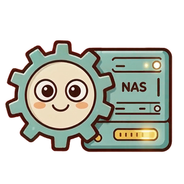

<div align="center">



# NAS管理器 · 群晖桌面管理工具

**管理 NAS 网站，从此不用再敲命令。**

[](https://github.com/dzf466628/NasManager/releases)
[](LICENSE)
[](https://www.python.org/)
[]()
[](https://duadu.cc)

<sub>一个编程小白用AI捣鼓出来的工具，代码可能稀烂但真心好用 · 觉得有用点个 ⭐ Star</sub>

</div>

NAS管理器是一款面向群晖 / Linux NAS 的 Windows 桌面管理工具，也是一套 **AI 写网站的部署框架**。Node 网站一键启停、Nginx 反向代理想配就配、服务进程 / 文件 / 终端 / 端口全部图形化。连接一次，点点鼠标，整套网站跑起来。

还在 SSH 里记路径、敲命令、杀进程？AI 写的网站反代配错、路径写死、部署就 404？打开 NAS管理器，**把这些全变成点一下。**

---

## 核心能力

### 网页服务器面板

自动扫描网站根目录，每个网站生成一张卡片，运行状态、进程号、运行时长、端口、主页健康度全部实时可见。顶部并排管理 Nginx 与 Node.js 运行环境。

- 一键启动 / 停止 / 重启，按工作目录与端口精准杀进程，杜绝端口残留
- 依赖、反向代理、开机自启三项状态自动检测，颜色标注一目了然
- 每个网站专属马卡龙主题色，运行中色条流动，多站不再混淆
- 实时日志、健康检查、双击选择启动文件 / 主页文件 / 端口


### 系统仪表盘

NAS 的 CPU、内存、网络上下行速率、运行时间、系统负载一屏掌握，刷新间隔自由设定；底部网站总览表实时汇总每个站点的目录、启动命令、端口与运行状态。

- 进度条直观呈现占用，网络速率实时跳动
- 后台线程采集，界面不卡顿
- 所有网站运行 / 停止状态同屏总览


### 服务管理

Nginx、Node.js、Docker、数据库等系统服务统一管理，启动停止合为一键，状态灯实时反馈；下方进程列表带 CPU / 内存占用，谁在吃资源一眼定位。

- 启停同一按钮，按当前状态自动切换，支持自定义服务
- Nginx 可视化「目录共享」开关，绿色显示在线共享数量
- 查看配置、重启服务、读取服务日志一键直达


### AI 写网站部署框架

连接 NAS 后自动探测真实环境，生成一份「网站能力评估」，一键复制发给 AI。Node 版本、网站根目录、可用域名、反代挂载点、Host 白名单全部实测，AI 照着约定写就能一次跑通。

- **标准化约定**：`server.js` 入口、`PORT = process.env.PORT || 3001`、`GET /api/health` 健康检查、监听 `0.0.0.0`
- **子路径部署**：前端 API 必须用相对路径 `fetch('api/xxx')`，避免绝对路径绕过反代前缀导致 404
- **静态兜底**：nginx 直接服务网站目录里的静态资源，node 只管 `/api/*` 和 SPA 路由 fallback
- **自动部署**：识别入口、`npm install`、配反代、一键启停，AI 写的网站拿来就能上

---

## 给 AI 写网站的约定

软件生成的「网站能力评估」里包含一套经过踩坑验证的部署约定，AI 照着写就能一次跑通：

### Node.js + Express 网站

- 根目录放一个 `server.js`（Node 服务唯一入口）
- 端口声明：`const PORT = process.env.PORT || 3001`（软件可自动识别端口）
- 提供 `GET /api/health` 健康检查端点（返回 JSON），便于软件确认服务存活
- Node 监听 `0.0.0.0`，便于反代和局域网访问
- 不要提交 `node_modules`，依赖由软件在 NAS 上 `npm install` 安装

### 子路径下访问（如 /zzz/、/myapp/）

- 前端请求 API 必须用相对路径 `fetch('api/xxx')`，不要写死绝对路径 `fetch('/api/xxx')`
- 原因：绝对路径会打到域名根，绕过反代前缀，导致 404（zzz 主页踩过的坑）
- 静态资源链接也用相对路径，不要假设自己部署在域名根 `/`

### 反代托管（Node 挂到域名/路径下）

- 软件反代已做静态兜底：网站目录里真实存在的文件（页面/图标/字体/媒体）由 nginx 直接服务
- node 的 `server.js` 不需要（也不要）写静态白名单拦截文件，否则会导致图标/资源 404（ptptpt 踩过的坑）
- 只需要 node 处理 `/api/*` 和 SPA 前端路由 fallback（无扩展名的路径返回 `index.html`）

### 目录型主页收录（如 zzz 主页）

- 在网站根目录放 `framework.json`，至少包含 `name/description/icon/version/link` 字段
- icon 路径区分大小写（Linux 敏感）：目录里是 `AG.png` 就不要写 `ag.png`

---

## 其余模块

| 模块 | 说明 |
|------|------|
| **端口管理** | netstat 结果解析成清晰表格，协议 / 监听地址 / 端口 / 进程号 / 进程名一应俱全，网站端口与常用端口高亮 |
| **文件管理** | SSH 远程可视化浏览目录，上传 / 下载 / 新建 / 重命名 / 删除齐全，内置文本编辑器，直接改 nginx、server.js 等配置文件 |
| **内置 SSH 终端** | 真正的交互式终端，无需另开 Xshell / PuTTY；命令历史上下切换，常用命令一键发送 |
| **系统配置一览** | 一键采集 NAS 完整环境快照与「网站能力评估」，系统版本、Node/nginx 路径、网站根目录、可用域名、端口监听、反代位置，一键复制直接发给 AI 协助排查 |
| **多 NAS 连接管理** | 一台软件管理多台群晖 / Linux NAS，连接列表带在线状态灯；密码保存在 Windows 凭据管理器，绝不写明文配置 |
| **连接即体检** | 每次连接自动探测真实环境：Node 路径、nginx 配置位置、网站根目录、域名与端口，后续所有操作都基于实测结果 |

---

## 四步上手

| 步骤 | 动作 | 说明 |
|------|------|------|
| **1** | 下载并安装 | 下载 Windows 安装包，双击安装，自动创建开始菜单与桌面快捷方式 |
| **2** | 新建 NAS 连接 | 填写 NAS 地址、SSH 端口、用户名密码，双击即可连接，密码加密托管 |
| **3** | 自动环境体检 | 软件自动探测 Node、nginx、网站目录、域名端口，缺 Node 还能一键安装 |
| **4** | 开始图形化管理 | 启停网站、配置反代、开目录共享、看日志改文件，全部点按钮完成 |

---

## 快速开始

### 从源码运行

```powershell
python -m pip install -r requirements.txt
python main.py
```

### 下载安装包

前往 [软件官网](https://duadu.cc/app/NasManager/index.html) 获取最新 Windows 安装包。

安装包面向 Windows 10 / 11 64 位，免运行时，安装即用。

---

## 兼容性

| 环境 | 说明 |
|------|------|
| **群晖 Synology DSM** | 适配 Web Station、套件路径、nginx 扩展点与 rc.d 开机自启机制 |
| **通用 Linux NAS** | 只要开启 SSH、具备 node / nginx 即可纳管，路径动态探测，不绑定单一发行版 |
| **Windows 客户端** | Windows 10 / 11 原生桌面程序，轻量安装包，无需安装 Python 或任何运行时 |

---

## 常见问题

<details>
<summary><b>密码存在哪里？安全吗？</b></summary>

密码走 Windows 凭据管理器，更新走 HTTPS 证书校验，杜绝明文与中间人风险。不会写入任何明文配置文件。

</details>

<details>
<summary><b>网站挂了会自动恢复吗？</b></summary>

会。故障自愈功能会在网站异常退出时自动拉起；反代配置被 Web Station 清空时自动重写并 reload，配好不再丢。

</details>

<details>
<summary><b>需要懂 Linux 命令吗？</b></summary>

不需要。所有操作都图形化了，点点鼠标就行。内置 SSH 终端是兜底，图形界面搞不定的可以随时回到命令行。

</details>

<details>
<summary><b>AI 写的网站怎么部署？</b></summary>

连接 NAS 后打开「系统配置一览」，生成「网站能力评估」，一键复制发给 AI。AI 按照评估里的约定写网站（server.js 入口、PORT 环境变量、相对路径、/api/health），然后把文件放到网站根目录，软件就能自动识别入口、npm install、配反代、一键启停。

</details>

<details>
<summary><b>为什么 AI 写的网站部署后 404？</b></summary>

最常见的原因是前端写了绝对路径 `fetch('/api/xxx')`，子路径部署时绝对路径会打到域名根，绕过反代前缀。改成相对路径 `fetch('api/xxx')` 即可。静态资源链接同理。

</details>

---

<div align="center">


**[duadu.cc](https://duadu.cc)** · 软件官网：[NAS管理器](https://duadu.cc/app/NasManager/index.html) · [GitHub](https://github.com/dzf466628/NasManager)

如果这个工具对你有帮助，点个 ⭐ **Star** 支持一下吧！
邮箱 3140992714@qq.com · 微信 vime1230 · 欢迎聊天交流


本软件以 **GNU GPL v3** 开源，可自由使用、修改与再分发。改了啥好玩的欢迎告诉我一声。

</div>

---

## 遥测说明

> 做遥测就俩原因：看看有没有人用，顺便看看哪个功能该砍。有人用我就挺开心的。有bug或者想聊天，邮箱甩过来。

本软件包含匿名使用统计上报，用于了解功能使用情况以改进产品。

**上报内容（均已脱敏）：**
- 软件版本号
- 功能使用计数（仅功能名 + 次数，不含文件名、路径、素材内容）
- 脱敏机器标识（MAC + 硬盘序列号经 SHA256 哈希取前 16 位，不可逆）
- 本机 IP 前三段（如 `192.168.0.*`）

**不上报：** 任何用户文件、路径、素材内容、个人身份信息。

**关闭方式：** 设置环境变量 `HTSJ_DISABLE=1` 即可完全关闭遥测。